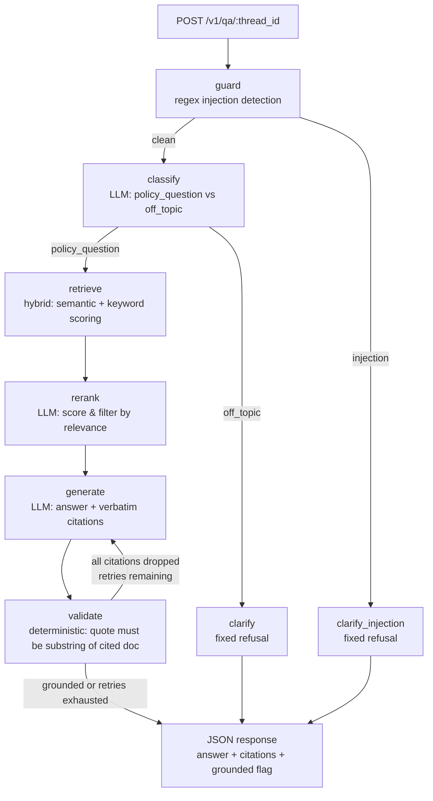

# LangGraph Policy Q&A POC on Azure

A small LangGraph service that answers questions about bundled policy
documents with verbatim, verified citations. Deployed on Azure Container
Apps, backed by Azure OpenAI, with a DeepEval evaluation harness that runs
against the live endpoint.

## Architecture



The graph deliberately mirrors a grounded-evaluation pipeline: LLM nodes
produce candidate output, then a deterministic node verifies every citation
is verbatim in the cited document before `grounded` is set. If validation
drops all citations, the graph retries generation once with a stricter
prompt before falling back to an "insufficient evidence" response.

### Key capabilities

- **Hybrid retrieval** — Azure OpenAI embeddings + FAISS semantic search,
  combined with keyword-overlap scoring. Falls back to keyword-only when
  embeddings are unavailable.
- **LLM re-ranking** — After retrieval, each chunk is scored 0–10 for
  relevance by the LLM; low-relevance chunks are dropped before generation,
  reducing noise and improving citation quality.
- **Multi-turn conversation** — Q&A history is accumulated per `thread_id`
  via a MemorySaver checkpointer and injected into classify/generate prompts
  so follow-up questions resolve correctly. **Note:** `MemorySaver` is
  in-memory; state is lost on restart or when requests hit different replicas.
  For production, swap to a persistent checkpointer (Redis, Cosmos DB).
- **Self-correction loop** — If `validate` drops all citations, the graph
  retries `generate` once with a stricter verbatim-copying prompt.
- **SSE streaming** — `POST /v1/qa/{thread_id}/stream` streams node-by-node
  progress as Server-Sent Events.
- **Prompt injection guard** — A regex-based guard node before classify
  detects common injection patterns and refuses with a fixed message.
- **Structured output** — `classify` and `generate` use JSON-schema-
  constrained responses (`response_format: json_schema`) for reliable
  parsing; falls back to free-form JSON mode if unsupported.
- **Retry with backoff** — Transient Azure OpenAI errors (rate limit,
  timeout, connection) are retried 3× with exponential backoff.
- **Rate limiting** — Per-API-key sliding-window limiter (30 req/min,
  configurable via `RATE_LIMIT_RPM`).
- **Deep health check** — `/healthz` probes LLM connectivity, reports
  uptime and latency alongside document count.

## Layout

| Path | Purpose |
| --- | --- |
| `app/main.py` | FastAPI app, `/healthz` (deep), `POST /v1/qa/{thread_id}`, SSE stream, rate limiter, API-key auth |
| `app/graph.py` | LangGraph `StateGraph`: guard → classify → retrieve → rerank → generate → validate (with retry loop) |
| `app/retriever.py` | Hybrid retrieval: FAISS semantic + keyword scoring, section metadata, verbatim check |
| `app/llm.py` | Azure OpenAI client: `chat_json` + `chat_structured` (JSON schema), tenacity retry |
| `app/data/*.md` | Three bundled sample policies (access control, incident response, data retention) |
| `tests/` | Offline unit tests: guard, retriever, validate, API endpoints, rate limiter |
| `evals/` | DeepEval + pytest harness that evaluates the deployed service |
| `.github/workflows/eval.yml` | CI pipeline: deterministic tests then LLM-judged metrics on every push/PR |
| `infra/main.bicep` | Reproducible Azure Bicep template (OpenAI, ACR, Container Apps, App Insights) |
| `infra/parameters.json` | Deployment parameters for the Bicep template |

## Azure deployment

| Resource | Name | Notes |
| --- | --- | --- |
| Resource group | `rg-langgraph-eval-poc` | eastus |
| Azure OpenAI | `aoai-lgpoc-eval` | `gpt-5-nano` deployment, GlobalStandard 30k TPM |
| Container registry | `acrlgpoc2675231837` | Basic; image `policy-qa:0.1.0` via remote `az acr build` |
| Container Apps env | `cae-lgpoc` | consumption plan |
| Container app | `ca-policy-qa` | HTTPS ingress, system-assigned identity, AcrPull |
| Application Insights | `ai-policy-qa` | workspace-based, shares the env's Log Analytics workspace |

Secrets (`POC_API_KEY`, `AZURE_OPENAI_API_KEY`,
`APPLICATIONINSIGHTS_CONNECTION_STRING`) are stored as Container Apps
secrets and injected via `secretref`; the registry is accessed with a
system-assigned managed identity, not admin credentials.

## Observability

The app is instrumented with OpenTelemetry via `azure-monitor-opentelemetry`
(FastAPI auto-instrumentation + explicit per-node spans + the OpenAI client
dependency calls). Each request produces a distributed trace:

`POST /v1/qa/{thread_id}` → `graph.node.guard` → `graph.node.classify` →
`graph.node.retrieve` → `graph.node.rerank` → `graph.node.generate` →
`graph.node.validate` (+ `POST .../chat/completions` spans to Azure OpenAI
inside the LLM nodes).

View it in the Azure portal under **Application Insights → ai-policy-qa**:

- **Transaction search** — pick any `POST /v1/qa` request to see the full
  node-by-node waterfall with per-node attributes (`graph.intent`,
  `graph.citations_count`, `graph.grounded`).
- **Application map** — service → Azure OpenAI dependency topology.
- **Metrics** — custom counters `qa.invocations` (by `intent`, `grounded`)
  and `qa.citations.valid` for charting.
- **Logs** — KQL over `requests`/`dependencies`/`traces`/`customMetrics`.

Eval runs also stream results as spans named `eval::<nodeid>` carrying
`eval.passed` / `eval.score` / `eval.reason`, so eval outcomes are queryable
and chartable in the same workspace. Useful KQL:

```kusto
// node latency per request
dependencies | where name startswith "graph.node." | summarize avg(duration) by name

// eval results over time
dependencies | where name startswith "eval::"
| extend passed = tobool(customDimensions["eval.passed"])
| summarize pass_rate = countif(passed) * 100.0 / count() by bin(timestamp, 1h)
```

**Gotcha encountered**: App Insights connection strings contain `;`
separators — they must be quoted when sourced in a shell env file,
otherwise only `InstrumentationKey` survives and the exporter falls back
to the global endpoint, whose regional redirect it refuses.

### Infrastructure as Code

The `infra/` directory contains a Bicep template (`main.bicep` +
`parameters.json`) that provisions the full stack reproducibly:

```bash
az group create --name rg-langgraph-eval-poc --location eastus
az deployment group create \
  --resource-group rg-langgraph-eval-poc \
  --template-file infra/main.bicep \
  --parameters infra/parameters.json \
  --parameters pocApiKey='<your-key>'
```

Manual deploy steps are also recorded in `azure/deploy.md`.

## Evaluation harness

Two layers, run with `pytest evals/`:

1. **Deterministic contract tests** (`evals/test_deterministic.py`) — the
   authoritative gates. Response schema, intent routing, expected-document
   retrieval, citation quotes verbatim in the cited document, `grounded`
   flag consistency, refusal behavior for off-topic input.
2. **LLM-judged metrics** (`evals/test_llm_judged.py`) — DeepEval
   `AnswerRelevancyMetric` and `FaithfulnessMetric` using Azure OpenAI
   (`gpt-5-nano`) as judge. Quality signals, not correctness gates.

Golden cases live in `evals/golden_dataset.json` (16 cases: answerable
policy questions across all three documents, cross-policy comparisons,
unanswerable edge cases, adversarial prompt injection, and off-topic
refusals).

CI runs automatically on push/PR via `.github/workflows/eval.yml` —
deterministic tests gate first, then LLM-judged metrics run if those pass.

### Running evals

```bash
set -a && source .env.azure && set +a
export POC_BASE_URL=https://ca-policy-qa.greenpond-2080be32.eastus.azurecontainerapps.io
export AZURE_OPENAI_DEPLOYMENT_NAME="$AZURE_OPENAI_DEPLOYMENT"
export OPENAI_API_VERSION="$AZURE_OPENAI_API_VERSION"
export DEEPEVAL_TELEMETRY_OPT_OUT=YES
.venv/bin/python -m pytest evals/ -v
```

## Local development

```bash
python3 -m venv .venv && .venv/bin/pip install -r requirements.txt
cp .env.example .env    # fill in your Azure credentials
set -a && source .env && set +a
POC_API_KEY=dev-key .venv/bin/uvicorn app.main:app --port 8000
```

### Running unit tests

```bash
POC_API_KEY=test-key \
AZURE_OPENAI_ENDPOINT=https://fake.openai.azure.com/ \
AZURE_OPENAI_API_KEY=fake-key \
.venv/bin/python -m pytest tests/ -v
```

Unit tests require no external services — they exercise the guard, retriever,
validate, and API layers in isolation.

## Known observation

`gpt-5-nano` is a reasoning model and spends tokens on hidden reasoning —
`max_completion_tokens` must be generous (4000 used here). Answer phrasing
varies between runs; that is exactly the variance the LLM-judged metrics
exist to catch.
