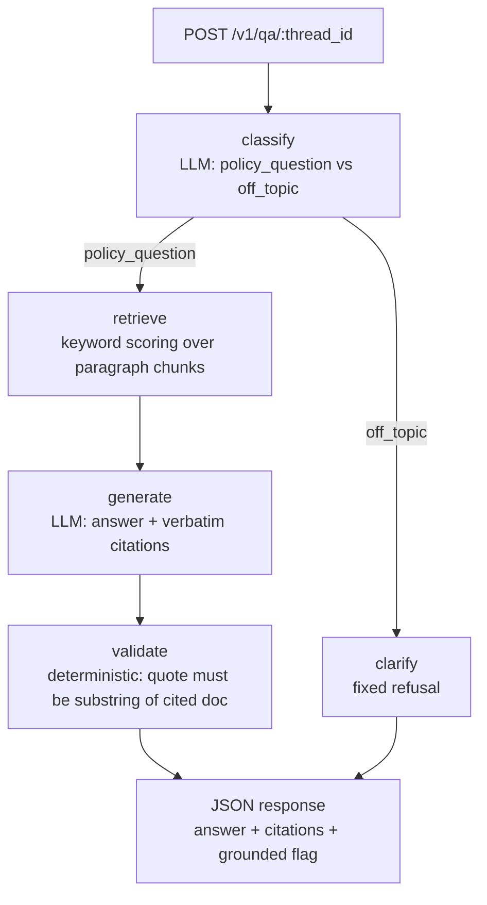

# LangGraph Policy Q&A POC on Azure

A small LangGraph service that answers questions about bundled policy
documents with verbatim, verified citations. Deployed on Azure Container
Apps, backed by Azure OpenAI, with a DeepEval evaluation harness that runs
against the live endpoint.

## Architecture



The graph deliberately mirrors a grounded-evaluation pipeline: LLM nodes
produce candidate output, then a deterministic node verifies every citation
is verbatim in the cited document before `grounded` is set. An answer with
zero surviving citations is replaced by an "insufficient evidence" response.

## Layout

| Path | Purpose |
| --- | --- |
| `app/main.py` | FastAPI app, `/healthz`, `POST /v1/qa/{thread_id}`, API-key auth |
| `app/graph.py` | LangGraph `StateGraph`: classify → retrieve → generate → validate |
| `app/retriever.py` | Paragraph chunking + normalized keyword-overlap scoring + verbatim quote check |
| `app/llm.py` | Azure OpenAI client (JSON-mode chat, empty-dict fallback on failure) |
| `app/data/*.md` | Three bundled sample policies (access control, incident response, data retention) |
| `evals/` | DeepEval + pytest harness that evaluates the deployed service |

## Azure deployment

| Resource | Name | Notes |
| --- | --- | --- |
| Resource group | `rg-langgraph-eval-poc` | eastus |
| Azure OpenAI | `aoai-lgpoc-eval` | `gpt-5-nano` deployment, GlobalStandard 30k TPM |
| Container registry | `acrlgpoc2675231837` | Basic; image `policy-qa:0.1.0` via remote `az acr build` |
| Container Apps env | `cae-lgpoc` | consumption plan |
| Container app | `ca-policy-qa` | HTTPS ingress, system-assigned identity, AcrPull |

Secrets (`POC_API_KEY`, `AZURE_OPENAI_API_KEY`) are stored as Container Apps
secrets and injected via `secretref`; the registry is accessed with a
system-assigned managed identity, not admin credentials.

Deploy steps are recorded in `azure/deploy.md`.

## Evaluation harness

Two layers, run with `pytest evals/`:

1. **Deterministic contract tests** (`evals/test_deterministic.py`) — the
   authoritative gates. Response schema, intent routing, expected-document
   retrieval, citation quotes verbatim in the cited document, `grounded`
   flag consistency, refusal behavior for off-topic input.
2. **LLM-judged metrics** (`evals/test_llm_judged.py`) — DeepEval
   `AnswerRelevancyMetric` and `FaithfulnessMetric` using Azure OpenAI
   (`gpt-5-nano`) as judge. Quality signals, not correctness gates.

Golden cases live in `evals/golden_dataset.json` (8 cases: answerable
policy questions, an unanswerable one, and two off-topic refusals).

### Running evals

```bash
set -a && source .env.azure && set +a
export POC_BASE_URL=https://ca-policy-qa.greenpond-2080be32.eastus.azurecontainerapps.io
export AZURE_OPENAI_DEPLOYMENT_NAME="$AZURE_OPENAI_DEPLOYMENT"
export OPENAI_API_VERSION="$AZURE_OPENAI_API_VERSION"
export DEEPEVAL_TELEMETRY_OPT_OUT=YES
.venv/bin/python -m pytest evals/ -v
```

## Local development

```bash
python3 -m venv .venv && .venv/bin/pip install -r requirements.txt
set -a && source .env.azure && set +a
POC_API_KEY=dev-key .venv/bin/uvicorn app.main:app --port 8000
```

## Known observation

`gpt-5-nano` is a reasoning model and spends tokens on hidden reasoning —
`max_completion_tokens` must be generous (4000 used here). Answer phrasing
varies between runs; that is exactly the variance the LLM-judged metrics
exist to catch.
